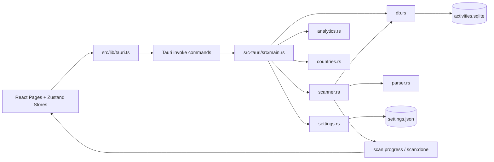

# Trajectory Developer Guide

> Last verified against the codebase: **August 7, 2026**

This guide is for contributors working on Trajectory's desktop app codebase.
It is intentionally practical: what exists today, how it fits together, and how to extend it safely.

## 1. Quick Start

### Prerequisites

- Node.js 22+
- Rust stable toolchain
- macOS (primary supported platform for local dev)
- GitHub Actions for preview/release builds on macOS, Windows, and Linux

### Install and run

```bash
npm ci
npm run tauri dev
```

### Quality checks

```bash
npm run check
```

This runs:

- TypeScript typecheck (`npm run typecheck`)
- activity-detail metric tests (`npm run test:activity-metrics`)
- Rust check (`cargo check --manifest-path src-tauri/Cargo.toml`)

### Build local production artifacts

```bash
npm run tauri build
```

Artifacts are created under:

- `src-tauri/target/release/bundle/macos/*.app`
- `src-tauri/target/release/bundle/dmg/*.dmg`
- `src-tauri/target/release/bundle/nsis/*.exe`
- `src-tauri/target/release/bundle/msi/*.msi`
- `src-tauri/target/release/bundle/deb/*.deb`
- `src-tauri/target/release/bundle/appimage/*.AppImage`

## 2. Product Scope (Current)

Trajectory is a local-first desktop app for exploring activity files.

Current stack:

- **Shell/runtime:** Tauri v2
- **Backend:** Rust
- **Frontend:** React + TypeScript + Vite + Tailwind
- **Storage:** SQLite + JSON settings

Supported activity files:

- `.tcx`
- `.txc` (accepted alias)
- `.fit`

Important behavior:

- The selected import folder is treated as read-only input.
- App data is stored in app-owned directories (`activities.sqlite`, `settings.json`).
- No cloud backend. No telemetry service.
- Map views still fetch external map tiles (OSM/CARTO) at runtime.

## 3. Repository Map

| Path | Purpose |
| --- | --- |
| `src/` | React frontend |
| `src-tauri/` | Tauri shell + Rust backend |
| `docs/DEVELOPER_GUIDE.md` | This document |
| `.github/workflows/ci.yml` | Typecheck + Rust quality gate |
| `.github/workflows/preview-bundles.yml` | Manual preview bundle pipeline for artifact testing |
| `.github/workflows/release.yml` | Tag-based macOS/Windows/Linux release pipeline |

### Project Structure

```text
.
├── src/
│   ├── components/      # shared UI building blocks
│   ├── lib/             # Tauri bridge wrappers and frontend utilities
│   ├── pages/           # route-level page components
│   ├── store/           # Zustand app/UI/analytics state
│   ├── types.ts         # frontend contract mirror for Rust DTOs
│   └── App.tsx          # app bootstrap, routing, startup scan flow
├── src-tauri/
│   ├── src/
│   │   ├── main.rs      # Tauri command registration and app wiring
│   │   ├── models.rs    # Rust DTOs shared across commands/modules
│   │   ├── scanner.rs   # file discovery + incremental/full scan logic
│   │   ├── parser.rs    # TCX/FIT parsing into normalized activities
│   │   ├── db.rs        # SQLite schema, migrations, and query layer
│   │   ├── analytics.rs # advanced analytics computation
│   │   ├── decoupling.rs # activity-level pace-HR decoupling and heart-rate drift
│   │   ├── countries.rs # offline country lookup and activity aggregation
│   │   └── settings.rs  # settings load/save and defaults
│   ├── Cargo.toml
│   └── tauri.conf.json
├── docs/
│   └── DEVELOPER_GUIDE.md
└── .github/
    └── workflows/
        ├── ci.yml
        ├── preview-bundles.yml
        └── release.yml
```

## 4. Architecture At A Glance



## 5. Frontend Overview

### App shell and routing

`src/App.tsx` handles:

- app bootstrap (`useAppStore.init()`)
- dark/light theme application
- accent theme CSS variable application
- automatic startup scan (once per selected import folder path)
- startup advanced analytics cache warm-up after a completed scan
- route rendering via `HashRouter`

Current routes:

| Route | Page |
| --- | --- |
| `/` | `DashboardPage` |
| `/activities` | `ActivitiesPage` |
| `/activities/:id` | `ActivityDetailPage` |
| `/heatmap` | `HeatmapPage` |
| `/analytics` | `AdvancedAnalyticsPage` |
| `/settings` | `SettingsPage` |

### Tauri bridge source of truth

`src/lib/tauri.ts` defines command wrappers and event listeners.

Current wrappers:

- `getSettings`
- `setImportFolder`
- `setDarkMode`
- `setAccentTheme`
- `setHeatmapFullOpacity`
- `setChartMaxSamples`
- `setChartOutlierRemoval`
- `setHeartRateZoneUpperBoundsBpm`
- `scanImportFolder`
- `listActivities`
- `getActivity`
- `getActivitySamples`
- `getAerobicDecoupling`
- `getHeatmapData`
- `getCountryActivityData`
- `runAdvancedAnalytics`
- `exportAnalyticsJson`
- `onScanProgress`

### Global state stores

| Store | File | Responsibility |
| --- | --- | --- |
| App/runtime state | `src/store/useAppStore.ts` | settings, scan lifecycle, in-memory activity cache, in-memory analytics cache |
| Persisted UI state | `src/store/useUiStateStore.ts` | filters, tabs, navigation memory, dashboard mode, heatmap controls |
| Persisted analytics definitions | `src/store/useAdvancedAnalyticsStore.ts` | metrics/streaks/charts definitions, selection, auto-run |

### Page behavior highlights

- **Onboarding:** directory picker + recursive toggle.
- **Settings:** tabs for Import, Appearance, Athlete Metrics.
  - Import actions: incremental rescan and full cache clear + rescan.
  - Appearance includes chart sample cap slider, chart outlier-removal toggle, and heatmap opacity preference.
  - Athlete Metrics manages heart-rate zone cutoffs.
- **Dashboard:** year/month calendar views with aggregate metrics and drilldowns.
- **Activities:** filter + sort table, navigation into details.
- **Activity Detail:**
  - fetches summary/track via `getActivity`
  - fetches chart samples via `getActivitySamples`
  - re-queries samples when zoom window, pause visibility, or `chartMaxSamples` changes
  - loads full-resolution activity records once and derives a memoized `selectedActivity` for summary metrics
  - recalculates duration, moving/paused time, heart-rate statistics, and heart-rate zones from the current drag or zoom range
  - GPS activities can switch between distance and time charts; time charts can collapse explicit paused segments into moving time
- **Heatmap:** map rendering with date/category/sport filters.
  - Routes renders the GPS-track overlay.
  - Countries highlights every country containing matching GPS samples.
  - Time spent shades those countries using elapsed time between consecutive activity samples.
- **Advanced Analytics:** custom metrics/streaks/charts builder + preview, selective JSON import/export.

## 6. Backend Overview

### Main app entry (`src-tauri/src/main.rs`)

Responsibilities:

- initialize app state and storage paths
- initialize SQLite schema
- ensure default settings file exists
- register Tauri command handlers
- validate input settings (accent theme, chart sample limits, HR zones)

### Storage and rescan behavior

- `activities.sqlite` stores normalized activity summaries plus per-sample data.
- Activity rows also track a parser version and serialized pause segments.
- Incremental scans reparse unchanged source files automatically when the parser version changes, so importer fixes can roll forward without requiring a manual full rescan.

Registered Tauri commands:

| Command | Purpose |
| --- | --- |
| `get_settings` | Read settings JSON |
| `set_import_folder` | Set folder + recursive scan option |
| `set_dark_mode` | Update theme mode |
| `set_accent_theme` | Update accent palette |
| `set_heatmap_full_opacity` | Toggle heatmap opacity mode |
| `set_chart_max_samples` | Persist chart sample cap |
| `set_chart_outlier_removal` | Toggle robust outlier suppression in Activity Detail charts |
| `set_heart_rate_zone_upper_bounds_bpm` | Save Z1-Z4 upper bpm limits (Z5 is everything above Z4) |
| `scan_import_folder` | Run incremental/full scan |
| `list_activities` | Query activity list |
| `get_activity` | Get activity summary + route track |
| `get_activity_samples` | Query/downsample chart samples |
| `get_aerobic_decoupling` | Calculate full-resolution pace-HR decoupling and heart-rate drift for a selected activity range |
| `get_heatmap_data` | Return heatmap tracks |
| `get_country_activity_data` | Aggregate GPS samples into country activity counts and elapsed time |
| `run_advanced_analytics` | Compute analytics payload |
| `export_analytics_json` | Write exported analytics JSON file |


### Scanner (`src-tauri/src/scanner.rs`)

What it does:

- discovers activity files (`.tcx`, `.txc`, `.fit`)
- supports recursive/non-recursive scan modes
- canonicalizes paths when possible
- compares `(source_path, source_mtime, source_size)` for incremental detection
- prunes deleted source files from DB on incremental scans
- supports full rebuild (`full_rescan = true`)
- emits progress/done events:
  - `scan:progress` `{ parsed, total, currentFile }`
  - `scan:done` `{ added, updated, skipped, errors }`

### Parser (`src-tauri/src/parser.rs`)

Parses TCX and FIT into normalized activity models.

Notable behavior:

- derives category/title fallbacks
- computes duration, moving time, distance, elevation, speed, HR stats
- supports summary-only FIT import if no point records are present
- parses cadence and power when available
- downsamples stored route track to `MAX_UI_POINTS = 2000`
- preserves full sample rows for DB insert (sampling happens at query time)

### Database layer (`src-tauri/src/db.rs`)

Responsibilities:

- schema creation and migrations (`DB_SCHEMA_VERSION = 2`)
- upsert activity + sample rows
- query list/detail/heatmap/sample windows
- query-side downsampling

Tables:

- `activities`
- `activity_samples`

Recent schema/migration coverage includes:

- `category`, `title`, `min_hr`, `moving_duration_seconds`
- sample-level `cadence`, `power_watts`

Sampling notes:

- `get_activity` returns summary + track (no samples)
- `get_activity_samples` returns filtered/downsampled sample windows
- Activity Detail can opt out of sample downsampling for its in-memory metric dataset; chart rendering remains capped separately
- default chart sample cap is `2000`, clamped in Rust (`50..=20000`)
- settings validation in `main.rs` accepts `100..=20000`

### Settings persistence (`src-tauri/src/settings.rs`)

- `load_settings(path)` reads JSON, falling back to defaults when missing.
- `save_settings(path, settings)` writes formatted JSON.

Default settings (current):

- `scanRecursive: true`
- `darkMode: false`
- `accentTheme: "citrus-orange"`
- `heatmapFullOpacity: false`
- `chartMaxSamples: 2000`
- `chartOutlierRemoval: true`
- `heartRateZoneUpperBoundsBpm: [120, 140, 160, 180]`

## 7. Contracts Between Frontend and Rust

Mirror files:

- Rust: `src-tauri/src/models.rs`
- TypeScript: `src/types.ts`

When changing any command payload or DTO:

1. Update Rust model(s) in `src-tauri/src/models.rs`.
2. Update backend behavior (`main.rs`, `db.rs`, `analytics.rs`, etc.).
3. Update TypeScript interfaces in `src/types.ts`.
4. Update bridge wrappers in `src/lib/tauri.ts`.
5. Update UI/store consumers.

Serialization uses camelCase mapping (`serde(rename_all = "camelCase")`).

## 8. Data Storage

App-managed files are created using Tauri path APIs:

- DB: app data directory, file `activities.sqlite`
- settings: app config directory, file `settings.json`

Design choices:

- tracks are stored as JSON in `activities.track_json` (map-friendly payload)
- detailed samples are stored in `activity_samples`
- UI-heavy views fetch sampled windows rather than always loading all points

## 9. Scan Lifecycle

### Automatic startup scan

1. App loads settings.
2. If import folder exists, `App.tsx` triggers a scan once for that folder path.
3. UI receives scan progress events.
4. On completion, caches are invalidated and `lastScanTimestamp` updates.
5. App optionally pre-warms advanced analytics cache for active definitions.

### Manual scan

- Triggered in Settings -> Import -> `Rescan`.
- Uses incremental behavior.

### Full rebuild

- Triggered in Settings -> Import -> `Clear Cache + Full Rescan`.
- Clears `activities` + `activity_samples`, then reimports all files.

## 10. Build, CI, Release

### Local build flow

- `npm ci`
- `npm run tauri dev` for development
- `npm run check` for quality gate
- `npm run tauri build` for local production bundles

### CI (`.github/workflows/ci.yml`)

- frontend quality job on Ubuntu:
  - `npm ci`
  - `npm run typecheck`
  - `npm run test:activity-metrics`
- rust quality job on Ubuntu, macOS, and Windows:
  - Linux runner installs Tauri system dependencies (`libwebkit2gtk-4.1-dev`, `libappindicator3-dev`, `librsvg2-dev`, `patchelf`)
  - `cargo check --manifest-path src-tauri/Cargo.toml`
  - `cargo fmt --manifest-path src-tauri/Cargo.toml --all -- --check`

### Preview bundles (`.github/workflows/preview-bundles.yml`)

Triggered manually from GitHub Actions.

Builds downloadable artifacts without creating a GitHub release:

- macOS: ad-hoc signed `.app` + `.dmg` (optional)
- Windows: `.exe` (NSIS) + `.msi`
- Linux: `.deb` + `.AppImage`

Use this workflow to validate that a branch is release-ready and hand the generated bundles to testers before tagging a real release.

### Release (`.github/workflows/release.yml`)

Triggered by tags matching `v*`.

Pipeline verifies version alignment across:

- git tag (without `v` prefix)
- `package.json`
- `src-tauri/tauri.conf.json`
- `src-tauri/Cargo.toml`

Then builds and publishes platform bundles via `tauri-apps/tauri-action`:

- macOS: `.app` + `.dmg` with ad-hoc signing
- Windows: `.exe` (NSIS) + `.msi`
- Linux: `.deb` + `.AppImage`

## 11. Common Extension Tasks

### Add a new Tauri command

1. Define/extend DTOs in `src-tauri/src/models.rs`.
2. Implement behavior in backend modules.
3. Add `#[tauri::command]` in `main.rs` and register it.
4. Add typed wrapper in `src/lib/tauri.ts`.
5. Mirror types in `src/types.ts`.
6. Consume in store/page/component.

### Add a new persisted setting

1. Add default + field in Rust `Settings`.
2. Add setter command in `main.rs`.
3. Mirror in TypeScript `Settings` interface.
4. Add UI controls and app-store update action.
5. Use the setting in rendering/query logic.

### Add a new activity filter

1. Update Rust + TS filter models.
2. Extend SQL predicates in `db::list_activities` and/or `db::get_heatmap_data`.
3. Pass through bridge wrapper.
4. Wire into UI state and page controls.
