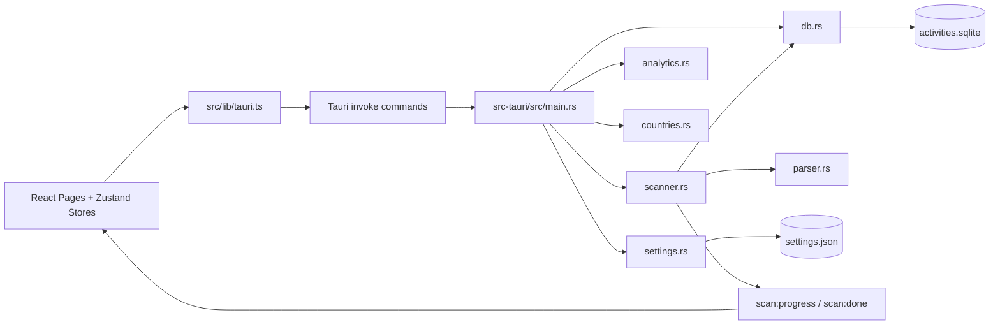

# Trajectory2 Developer Guide

This guide is for contributors working on the Trajectory2 source in this repository.
It is intentionally practical: what exists today, how it fits together, and how to extend it safely.

## 1. Quick Start

### Prerequisites

Follow [Build and install Trajectory2](../README.md#build-and-install-trajectory2)
in the first README section for the complete platform installation steps.

- Latest Node.js 22, at least 22.12.0, with npm (`.nvmrc` selects the CI Node line).
- Current stable Rust through rustup, at least 1.88 for the locked `time` dependency.
  `rust-toolchain.toml` selects stable with `rustfmt`; `Cargo.toml` records the minimum.
- macOS: Xcode Command Line Tools; native Apple Silicon and Intel builds.
- Windows x64: MSVC C++ Build Tools, Windows SDK, WebView2, and VBScript for MSI packaging.
- Linux x64: GTK 3/WebKitGTK 4.1 development libraries and C/C++/packaging tools.
  Run `bash scripts/install-tauri-linux-deps.sh` on Ubuntu 22.04+ or Debian 12+.

SQLite is bundled by `rusqlite`; country data and icons are supplied locally.
There is no Python, external FIT SDK, database service, or secret configuration step.
The installed app is still named Trajectory, with identifier `com.trajectory.desktop`.

### Install and run

```bash
npm ci
npm run tauri -- dev
```

### Quality checks

```bash
npm run check
```

This runs:

- App version alignment, including both lockfiles (`npm run check:versions`)
- TypeScript typecheck (`npm run typecheck`)
- activity metrics, chart interaction, request-race, and analytics cache tests (`npm run test:activity-metrics`)
- Rust check and regression tests (`npm run check:rust`, `npm run test:rust`)
- Rust formatting (`npm run check:rust-format`)

### Build local production artifacts

```bash
npm run tauri -- build -- --locked
```

On Linux, set `export APPIMAGE_EXTRACT_AND_RUN=1` before packaging to allow the
AppImage tooling to run without FUSE. Use a graphical session to run the app.

Tauri runs the version check and frontend build automatically before compiling Rust.
`npm run build` produces only `dist/`; use the Tauri command for the desktop app.
The final `-- --locked` forwards Cargo's lockfile enforcement flag. Build on the
target OS; installers are not cross-platform.

Artifacts for the current host are created under:

- `src-tauri/target/release/bundle/macos/*.app`
- `src-tauri/target/release/bundle/dmg/*.dmg`
- `src-tauri/target/release/bundle/nsis/*.exe`
- `src-tauri/target/release/bundle/msi/*.msi`
- `src-tauri/target/release/bundle/deb/*.deb`
- `src-tauri/target/release/bundle/appimage/*.AppImage`

These paths assume no explicit `--target` or `CARGO_TARGET_DIR`; see section 10
for overrides. The README's second section preserves the original project's
historical instructions; use its first, Trajectory2 section for this source tree.

## 2. Product Scope (Current)

Trajectory is a local-first desktop app for exploring activity files.

Current stack:

- **Shell/runtime:** Tauri v2
- **Backend:** Rust
- **Frontend:** React + TypeScript + Vite + Tailwind
- **Storage:** SQLite + JSON settings

Supported activity files:

- `.tcx`
- `.txc` (accepted alias)
- `.fit`

Important behavior:

- The selected import folder is treated as read-only input.
- App data is stored in app-owned directories (`activities.sqlite`, `settings.json`).
- No cloud backend. No telemetry service.
- Map views still fetch external map tiles (OSM/CARTO) at runtime.

## 3. Repository Map

| Path | Purpose |
| --- | --- |
| `src/` | React frontend |
| `src-tauri/` | Tauri shell + Rust backend |
| `docs/DEVELOPER_GUIDE.md` | This document |
| `.nvmrc`, `rust-toolchain.toml` | Shared local/CI toolchain selection |
| `scripts/install-tauri-linux-deps.sh` | Ubuntu/Debian native build prerequisites |
| `scripts/verify-version-alignment.mjs` | Portable app and lockfile version validation |
| `src-tauri/tauri.*.conf.json` | Per-platform installer formats and macOS ad-hoc signing |
| `.github/workflows/ci.yml` | Frontend/Rust quality gate and native release compilation |
| `.github/workflows/preview-bundles.yml` | Manual preview bundle pipeline for artifact testing |
| `.github/workflows/release.yml` | Tag-based macOS/Windows/Linux release pipeline |

### Project Structure

```text
.
├── src/
│   ├── components/      # shared UI building blocks
│   ├── lib/             # Tauri bridge wrappers and frontend utilities
│   ├── pages/           # route-level page components
│   ├── store/           # Zustand app/UI/analytics state
│   ├── types.ts         # frontend contract mirror for Rust DTOs
│   └── App.tsx          # app bootstrap, routing, startup scan flow
├── src-tauri/
│   ├── src/
│   │   ├── main.rs      # Tauri command registration and app wiring
│   │   ├── models.rs    # Rust DTOs shared across commands/modules
│   │   ├── scanner.rs   # file discovery + incremental/full scan logic
│   │   ├── parser.rs    # TCX/FIT parsing into normalized activities
│   │   ├── db.rs        # SQLite schema, migrations, and query layer
│   │   ├── analytics.rs # advanced analytics computation
│   │   ├── decoupling.rs # activity-level pace-HR decoupling and heart-rate drift
│   │   ├── countries.rs # offline country lookup and activity aggregation
│   │   └── settings.rs  # settings load/save and defaults
│   ├── Cargo.toml
│   └── tauri.conf.json
├── docs/
│   └── DEVELOPER_GUIDE.md
└── .github/
    └── workflows/
        ├── ci.yml
        ├── preview-bundles.yml
        └── release.yml
```

## 4. Architecture At A Glance


```mermaid
flowchart LR
  UI[React Pages + Zustand Stores] --> Bridge[src/lib/tauri.ts]
  Bridge --> TauriInvoke[Tauri invoke commands]
  TauriInvoke --> Main[src-tauri/src/main.rs]
  Main --> Scanner[scanner.rs]
  Main --> DB[db.rs]
  Main --> Analytics[analytics.rs]
  Main --> Countries[countries.rs]
  Main --> Settings[settings.rs]
  Scanner --> Parser[parser.rs]
  Scanner --> DB
  DB --> SQLite[(activities.sqlite)]
  Settings --> SettingsFile[(settings.json)]
  Scanner --> Events[scan:progress / scan:done]
  Events --> UI
```

## 5. Frontend Overview

### App shell and routing

`src/App.tsx` handles:

- app bootstrap (`useAppStore.init()`)
- dark/light theme application
- accent theme CSS variable application
- automatic startup scan (once per selected import folder path)
- startup advanced analytics cache warm-up after a completed scan; cache keys include import folder, scan version, HR zones, and complete definitions
- route rendering via `HashRouter`

Current routes:

| Route | Page |
| --- | --- |
| `/` | `DashboardPage` |
| `/activities` | `ActivitiesPage` |
| `/activities/:id` | `ActivityDetailPage` |
| `/heatmap` | `HeatmapPage` |
| `/analytics` | `AdvancedAnalyticsPage` |
| `/settings` | `SettingsPage` |

### Tauri bridge source of truth

`src/lib/tauri.ts` defines command wrappers and event listeners.

Current wrappers:

- `getSettings`
- `setImportFolder`
- `setDarkMode`
- `setAccentTheme`
- `setHeatmapFullOpacity`
- `setChartMaxSamples`
- `setChartOutlierRemoval`
- `setHeartRateZoneUpperBoundsBpm`
- `scanImportFolder`
- `listActivities`
- `getActivity`
- `getActivitySamples`
- `getAerobicDecoupling`
- `getHeatmapData`
- `getCountryActivityData`
- `runAdvancedAnalytics`
- `exportAnalyticsJson`
- `onScanProgress`

### Global state stores

| Store | File | Responsibility |
| --- | --- | --- |
| App/runtime state | `src/store/useAppStore.ts` | settings, scan lifecycle, in-memory activity cache, in-memory analytics cache |
| Persisted UI state | `src/store/useUiStateStore.ts` | filters, tabs, navigation memory, dashboard mode, heatmap controls |
| Persisted analytics definitions | `src/store/useAdvancedAnalyticsStore.ts` | metrics/streaks/charts definitions, selection, auto-run |

### Page behavior highlights

- **Onboarding:** directory picker + recursive toggle.
- **Settings:** tabs for Import, Appearance, Athlete Metrics.
  - Import actions: incremental rescan and full cache clear + rescan.
  - Appearance includes chart sample cap slider, chart outlier-removal toggle, and heatmap opacity preference.
  - Athlete Metrics manages heart-rate zone cutoffs.
- **Dashboard:** year/month calendar views with aggregate metrics and drilldowns.
- **Activities:** filter + sort table, navigation into details.
- **Activity Detail:**
  - loads detail and full-resolution samples together via `useActivityData`; activity changes and rescans discard stale requests
  - resolves live drag/zoom boundaries once to elapsed time in `activityData.ts`; charts, cards, zones, and decoupling use those boundaries
  - clips/interpolates chart endpoints before applying the display sample cap, so zooming restores detail on either axis
  - marks selected metrics with `(Segment)`; reset restores authoritative workout summaries; missing segment data is shown as unavailable
  - offers distance charts whenever cumulative distance is usable (including indoor activities); time charts can collapse recorded pauses
  - computes segment distance from cumulative-distance endpoints and average speed/pace from distance and moving time; timer pauses are excluded without scaling by a whole-workout ratio
  - weights HR, cadence, and power by adjacent active sample intervals; missing readings break the held value, gaps over 300 seconds are excluded, and averages require 80% coverage
  - computes elevation changes from clipped adjacent altitude samples; incomplete altitude coverage is unavailable
  - uses debounced, stale-response-safe decoupling requests over the same elapsed range; compares equal active-time halves, requiring at least 60 active seconds and 80% valid coverage per half (recording gaps over 30 seconds are unobserved)
  - treats decoupling as a descriptive comparison: short, stopped, or incomplete ranges return typed unavailability reasons; interval workouts and changing terrain can affect interpretation
- **Heatmap:** map rendering with date/category/sport filters.
  - Routes renders the GPS-track overlay.
  - Countries highlights every country containing matching GPS samples.
  - Time spent shades those countries using elapsed time between consecutive activity samples.
- **Advanced Analytics:** custom metrics/streaks/charts builder + preview, selective JSON import/export.

## 6. Backend Overview

### Main app entry (`src-tauri/src/main.rs`)

Responsibilities:

- initialize app state and storage paths
- initialize SQLite schema
- ensure default settings file exists
- register Tauri command handlers
- validate input settings (accent theme, chart sample limits, HR zones)

### Storage and rescan behavior

- `activities.sqlite` stores normalized activity summaries plus per-sample data.
- Activity rows also track a parser version and serialized pause segments.
- Incremental scans reparse unchanged source files automatically when the parser version changes, so importer fixes can roll forward without requiring a manual full rescan.

Registered Tauri commands:

| Command | Purpose |
| --- | --- |
| `get_settings` | Read settings JSON |
| `set_import_folder` | Set folder + recursive scan option |
| `set_dark_mode` | Update theme mode |
| `set_accent_theme` | Update accent palette |
| `set_heatmap_full_opacity` | Toggle heatmap opacity mode |
| `set_chart_max_samples` | Persist chart sample cap |
| `set_chart_outlier_removal` | Toggle robust outlier suppression in Activity Detail charts |
| `set_heart_rate_zone_upper_bounds_bpm` | Save Z1-Z4 upper bpm limits (Z5 is everything above Z4) |
| `scan_import_folder` | Run incremental/full scan |
| `list_activities` | Query activity list |
| `get_activity` | Get activity summary + route track |
| `get_activity_samples` | Query/downsample chart samples |
| `get_aerobic_decoupling` | Calculate full-resolution pace-HR decoupling and heart-rate drift for a selected activity range |
| `get_heatmap_data` | Return heatmap tracks |
| `get_country_activity_data` | Aggregate GPS samples into country activity counts and elapsed time |
| `run_advanced_analytics` | Compute analytics payload |
| `export_analytics_json` | Write exported analytics JSON file |


### Scanner (`src-tauri/src/scanner.rs`)

What it does:

- discovers activity files (`.tcx`, `.txc`, `.fit`)
- supports recursive/non-recursive scan modes
- canonicalizes paths when possible
- compares `(source_path, source_mtime, source_size)` for incremental detection
- prunes deleted source files from DB on incremental scans
- supports full rebuild (`full_rescan = true`)
- emits progress/done events:
  - `scan:progress` `{ parsed, total, currentFile }`
  - `scan:done` `{ added, updated, skipped, errors }`

### Parser (`src-tauri/src/parser.rs`)

Parses TCX and FIT into normalized activity models.

Notable behavior:

- derives category/title fallbacks
- computes duration, moving time, distance, elevation, speed, HR stats
- supports summary-only FIT import if no point records are present
- parses cadence and power when available
- downsamples stored route track to `MAX_UI_POINTS = 2000`
- preserves full sample rows for DB insert (sampling happens at query time)

### Database layer (`src-tauri/src/db.rs`)

Responsibilities:

- schema creation and migrations (`DB_SCHEMA_VERSION = 3`)
- upsert activity + sample rows
- query list/detail/heatmap/sample windows
- query-side downsampling

Tables:

- `activities`
- `activity_samples`

Recent schema/migration coverage includes:

- `category`, `title`, `min_hr`, `moving_duration_seconds`
- sample-level `cadence`, `power_watts`

Sampling notes:

- `get_activity` returns summary + track (no samples)
- `get_activity_samples` returns filtered/downsampled sample windows
- Activity Detail can opt out of sample downsampling for its in-memory metric dataset; chart rendering remains capped separately
- default chart sample cap is `2000`, clamped in Rust (`50..=20000`)
- settings validation in `main.rs` accepts `100..=20000`

### Settings persistence (`src-tauri/src/settings.rs`)

- `load_settings(path)` reads JSON, falling back to defaults when missing.
- `save_settings(path, settings)` writes formatted JSON.

Default settings (current):

- `scanRecursive: true`
- `darkMode: false`
- `accentTheme: "citrus-orange"`
- `heatmapFullOpacity: false`
- `chartMaxSamples: 2000`
- `chartOutlierRemoval: true`
- `heartRateZoneUpperBoundsBpm: [120, 140, 160, 180]`

## 7. Contracts Between Frontend and Rust

Mirror files:

- Rust: `src-tauri/src/models.rs`
- TypeScript: `src/types.ts`

When changing any command payload or DTO:

1. Update Rust model(s) in `src-tauri/src/models.rs`.
2. Update backend behavior (`main.rs`, `db.rs`, `analytics.rs`, etc.).
3. Update TypeScript interfaces in `src/types.ts`.
4. Update bridge wrappers in `src/lib/tauri.ts`.
5. Update UI/store consumers.

Serialization uses camelCase mapping (`serde(rename_all = "camelCase")`).

## 8. Data Storage

App-managed files are created using Tauri path APIs:

- DB: app data directory, file `activities.sqlite`
- settings: app config directory, file `settings.json`

Design choices:

- tracks are stored as JSON in `activities.track_json` (map-friendly payload)
- detailed samples are stored in `activity_samples`
- Maps use sampled tracks; Activity Detail retains full samples for metrics and caps chart rendering separately

## 9. Scan Lifecycle

### Automatic startup scan

1. App loads settings.
2. If import folder exists, `App.tsx` triggers a scan once for that folder path.
3. UI receives scan progress events.
4. On completion, caches are invalidated and `lastScanTimestamp` updates.
5. App optionally pre-warms advanced analytics cache for active definitions.

### Manual scan

- Triggered in Settings -> Import -> `Rescan`.
- Uses incremental behavior.

### Full rebuild

- Triggered in Settings -> Import -> `Clear Cache + Full Rescan`.
- Clears `activities` + `activity_samples`, then reimports all files.

## 10. Build, CI, Release

### Local build flow

- `npm ci`
- `npm run tauri -- dev` for development
- `npm run check` for quality gate
- `npm run tauri -- build -- --locked` for local production bundles

Use the checked-in npm and Cargo lockfiles. The Node engine requirement is
`>=22.12.0`; `.nvmrc` chooses the latest Node 22 patch in CI. Rust uses stable with
`rustfmt`, with a declared minimum of 1.88. No global Tauri CLI is needed.

Tauri merges the host's `tauri.macos.conf.json`, `tauri.windows.conf.json`, or
`tauri.linux.conf.json` with `tauri.conf.json`. These files are the source of truth
for bundle formats, shared by local builds, previews, and releases:

| Platform | Formats | Default signing |
| --- | --- | --- |
| macOS | `.app`, `.dmg` | Ad-hoc (`signingIdentity: "-"`), no notarization |
| Windows | NSIS `.exe`, WiX `.msi` | Unsigned |
| Linux | `.deb`, `.AppImage` | Unsigned |

`vite.config.ts` targets ES2020/Safari 15 syntax to match the macOS 12 deployment
target instead of inheriting Vite 7's newer browser baseline. Windows uses an
Evergreen WebView2 runtime; Linux uses the distribution's WebKitGTK 4.1 runtime.

`beforeBuildCommand` verifies versions and compiles the frontend. Tauri then embeds
`dist/` in the native executable; the installed app does not need the Vite server.
`npm run dev` / `npm run preview` only serve the frontend in a browser and cannot
provide the native Tauri commands used for settings, imports, or analytics.

Useful build overrides:

```sh
# Compile a production desktop executable without creating installers.
npm run tauri -- build --no-bundle -- --locked

# macOS: build only the .app (for example, when a headless host cannot create a DMG).
npm run tauri -- build --bundles app -- --locked

# macOS: create a DMG without Finder automation/window layout.
CI=true npm run tauri -- build -- --locked

# Windows: NSIS only, without the MSI/VBScript prerequisite.
npm run tauri -- build --bundles nsis -- --locked

# Linux: Debian package only.
npm run tauri -- build --bundles deb -- --locked
```

On a Mac, an optional universal app requires both Rust targets:

```sh
rustup target add aarch64-apple-darwin x86_64-apple-darwin
npm run tauri -- build --target universal-apple-darwin -- --locked
```

With an explicit target, look under `src-tauri/target/<target>/release/bundle/`
(for the command above, `<target>` is `universal-apple-darwin`). `CARGO_TARGET_DIR`
also changes the output root. Default workflows build separately on native hosts.

For Linux distribution builds, use the oldest supported build environment with
WebKitGTK 4.1; this repository uses Ubuntu 22.04. A newer local distribution can
introduce a newer glibc/system-library requirement into the resulting package.
See [Tauri's AppImage guidance](https://v2.tauri.app/distribute/appimage/).

### CI (`.github/workflows/ci.yml`)

Runs on pushes to `main` and pull requests. Each native host runs `npm ci`, the full
`npm run check`, and `npm run tauri -- build --no-bundle -- --locked`:

- `ubuntu-22.04`: Linux x64, using the checked-in native-dependency helper.
- `macos-15`: Apple Silicon.
- `macos-15-intel`: Intel macOS.
- `windows-2022`: Windows x64/MSVC.

The production compilation checks frontend embedding and native release builds;
installer creation is covered by the preview/release workflows.

### Preview bundles (`.github/workflows/preview-bundles.yml`)

Triggered manually from GitHub Actions.

Builds downloadable artifacts without creating a GitHub release:

- macOS: ad-hoc signed `.app` + `.dmg`, separately for Apple Silicon and Intel (optional)
- Windows: `.exe` (NSIS) + `.msi`
- Linux: `.deb` + `.AppImage`

Use this workflow to validate that a branch is release-ready and hand the generated bundles to testers before tagging a real release.

Each job runs `npm run check` before `npm run tauri -- build --ci -- --locked`.
The optional `version` input accepts a version or `v`-prefixed tag and must match
the source metadata. Linux packaging sets `APPIMAGE_EXTRACT_AND_RUN=1`.
The macOS job verifies the signature, then archives the `.app` as `.app.tar.gz`
before uploading it so permissions and symlinks survive the artifact download.
Preview artifacts are retained for 14 days and do not create a GitHub release.
On CI, DMG creation skips cosmetic Finder automation. The release workflow also
sets `TAURI_BUNDLER_DMG_IGNORE_CI=false` to retain this behavior in `tauri-action`.

### Release (`.github/workflows/release.yml`)

Triggered by tags matching `v*`.

Pipeline verifies version alignment across:

- git tag (normalizing the `v` prefix)
- `package.json`
- `package-lock.json` (top level and root package)
- `src-tauri/tauri.conf.json`
- `src-tauri/Cargo.toml`
- `src-tauri/Cargo.lock` (the `trajectory` package)

The same portable Node script runs locally via `npm run check:versions`, during
Tauri production builds, and in CI. The old `.sh` entry point delegates to it.
To prepare a release, update the three app manifests and synchronize both lockfiles,
run `npm run check`, validate preview bundles, then create a matching `v<version>` tag.
Do not point a new tag at a commit whose package versions differ.

Each job runs the quality gate, then builds and publishes a **Trajectory2** release
via `tauri-apps/tauri-action`, using the host configuration and `--ci -- --locked`:

- macOS Apple Silicon and Intel: `.app` + `.dmg` with ad-hoc signing
- Windows: `.exe` (NSIS) + `.msi`
- Linux: `.deb` + `.AppImage`

Publishing a matching tag triggers publication automatically (`releaseDraft: false`).
Production Developer ID signing/notarization and Windows signing are not configured.
The app name, package name, and storage identifier remain Trajectory for compatibility.

### Build troubleshooting

| Symptom | Resolution |
| --- | --- |
| Vite rejects Node or reports `crypto.hash is not a function` | Use Node 22.12+; the latest Node 22 patch matches `.nvmrc`. Reopen the terminal and rerun `npm ci`. |
| Cargo reports a newer Rust requirement | Run `rustup update stable`; the locked dependencies need at least Rust 1.88. |
| `cargo` is not found | Reopen the terminal after rustup installation; on macOS/Linux load `$HOME/.cargo/env`. |
| Linux cannot find `webkit2gtk-4.1`, GTK, or `pkg-config` | Run the Linux dependency helper on Ubuntu/Debian or install the distribution's equivalent development packages. WebKitGTK 4.0 is insufficient. |
| Windows cannot find `link.exe` or Windows SDK libraries | Install the C++ workload/SDK and select the MSVC Rust host; reopen the terminal. |
| PowerShell blocks `npm.ps1` | Use `npm.cmd` for the npm commands, or run them in Command Prompt. |
| Windows `failed to run light.exe` during MSI packaging | Enable the VBScript optional feature, or build NSIS only. |
| AppImage packaging cannot mount a helper | Set `APPIMAGE_EXTRACT_AND_RUN=1` in the build shell. |
| Launching an AppImage fails because FUSE is missing | Install the distribution's FUSE 2 compatibility package, or launch with `--appimage-extract-and-run`. |
| macOS DMG packaging fails on a headless host | Build with `--bundles app` and use the generated `.app`; retry DMG packaging from a logged-in desktop session. |
| macOS says `Not authorised to send Apple events to Finder` | Allow your terminal to control Finder in System Settings > Privacy & Security > Automation, or run `CI=true npm run tauri -- build -- --locked` to skip the DMG window layout. |
| Output under `dist/` or `src-tauri/target/` is not writable | Use a checkout/build directory owned by your user. Avoid running npm or Cargo with `sudo`. |
| Version validation fails | Align the app versions and both lockfiles; do not bypass the check for a release. |

## 11. Common Extension Tasks

### Add a new Tauri command

1. Define/extend DTOs in `src-tauri/src/models.rs`.
2. Implement behavior in backend modules.
3. Add `#[tauri::command]` in `main.rs` and register it.
4. Add typed wrapper in `src/lib/tauri.ts`.
5. Mirror types in `src/types.ts`.
6. Consume in store/page/component.

### Add a new persisted setting

1. Add default + field in Rust `Settings`.
2. Add setter command in `main.rs`.
3. Mirror in TypeScript `Settings` interface.
4. Add UI controls and app-store update action.
5. Use the setting in rendering/query logic.

### Add a new activity filter

1. Update Rust + TS filter models.
2. Extend SQL predicates in `db::list_activities` and/or `db::get_heatmap_data`.
3. Pass through bridge wrapper.
4. Wire into UI state and page controls.

## 12. Contributor Data Hygiene

Keep activity imports, app databases/settings, local environment files, generated bundles,
and development session files outside the source tree. Tests construct synthetic activity
samples in code; the bundled analytics JSON contains example definitions only. Additional
file fixtures belong under `tests/fixtures/synthetic/` and need an exact `.gitignore`
exception after review for location, device, health, and timestamp data.

Use this guide for architecture and maintenance notes. Describe current behavior and
rationale here instead of storing personal task logs or agent session records. Preserve the
original author credit and MIT license, map-provider attribution, and dependency notices.
